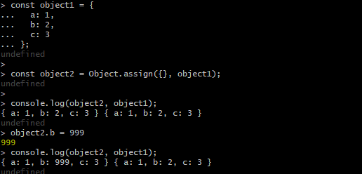
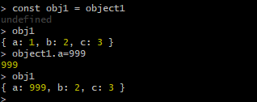
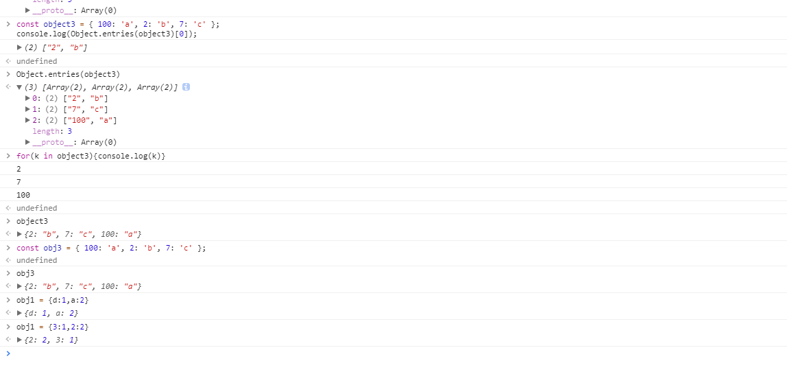

# Object
## Object.assign()
### 说明
通过复制一个或多个对象来创建一个新的对象。
```
const object1 = {
  a: 1,
  b: 2,
  c: 3
};

const object2 = Object.assign({}, object1);


> console.log(object2, object1);
{ a: 1, b: 2, c: 3 } { a: 1, b: 2, c: 3 }

object2.b = 999
> console.log(object2, object1);
{ a: 1, b: 999, c: 3 } { a: 1, b: 2, c: 3 }

var o1 = { a: 1, b: 1, c: 1 };
var o2 = { b: 2, c: 2 };
var o3 = { c: 3 };

var obj = Object.assign({}, o1, o2, o3);
console.log(obj); // { a: 1, b: 2, c: 3 }
```
  
  
因为Object 是值引用类型 所以当你把变量A复制的时候对应的B也会更改 但是使用 Object.assign 将所有可枚举属性的值从一个或多个源对象复制到目标对象 **[仅针对浅拷贝]** ,当然也可以合并不同的对象之间的值

## Object.defineProperties 
直接在一个对象上定义新的属性或修改现有属性，并返回该对象。
需要注意的是 `Object.defineProperties(obj, props)` 中的 `props`

### **属性描述符**

对象里目前存在的属性描述符有两种主要形式：数据描述符和存取描述符。数据描述符是一个具有值的属性，该值可能是可写的，也可能不是可写的。存取描述符是由getter-setter函数对描述的属性。描述符必须是这两种形式之一；不能同时是两者。

数据描述符和存取描述符均具有以下可选键值：

#### configurable
当且仅当该属性的 `configurable` 为 `true` 时，该属性描述符才能够被改变，同时该属性也能从对应的对象上被删除。默认为 `false。`
#### enumerable
当且仅当该属性的 `enumerable` 为 `true` 时，该属性才能够出现在对象的枚举属性中。默认为 `false。`
数据描述符同时具有以下可选键值：

#### value
该属性对应的值。可以是任何有效的 JavaScript 值（数值，对象，函数等）。默认为 `undefined`。
#### writable
当且仅当该属性的writable为true时，value才能被赋值运算符改变。默认为 `false。`

#### 存取描述符同时具有以下可选键值：

##### get
一个给属性提供 `getter` 的方法，如果没有 `getter ` 则为 `undefined`。该方法返回值被用作属性值。默认为 `undefined`。
##### set
一个给属性提供 `setter` 的方法，如果没有 `setter` 则为 `undefined`。该方法将接受唯一参数，并将该参数的新值分配给该属性。默认为 `undefined`。

#### 描述符可同时具有的键值

| configurable | enumerable | value | writable | get | set |
| ------------ | ---------- | ----- | -------- | --- | --- |
| 数据描述符   | Yes        | Yes   | Yes      | Yes | No  | No |
| 存取描述符   | Yes        | Yes   | No       | No  | Yes | Yes |

**如果一个描述符不具有value,writable,get 和 set 任意一个关键字，那么它将被认为是一个数据描述符。如果一个描述符同时有(value或writable)和(get或set)关键字，将会产生一个异常。**

记住，这些选项不一定是自身属性，如果是继承来的也要考虑。为了确认保留这些默认值，你可能要在这之前冻结 Object.prototype，明确指定所有的选项，或者将`__proto__`属性指向`null`。

> Ref : [Object.defineProperty ](https://developer.mozilla.org/zh-CN/docs/Web/JavaScript/Reference/Global_Objects/Object/defineProperty)
## Object.entries()
**当 `object` 中的 `key` 为数字时会自动排序**


Object.entries()方法返回一个给定对象自身可枚举属性的键值对数组，其排列与使用 for...in 循环遍历该对象时返回的顺序一致（区别在于 for-in 循环也枚举原型链中的属性）
```
const object1 = { foo: 'bar', baz: 42 };
console.log(Object.entries(object1)[1]);
// expected output: Array ["baz", 42]

const object2 = { 0: 'a', 1: 'b', 2: 'c' };
console.log(Object.entries(object2)[2]);
// expected output: Array ["2", "c"]

const object3 = { 100: 'a', 2: 'b', 7: 'c' };
console.log(Object.entries(object3)[0]);
// expected output: Array ["2", "b"]```