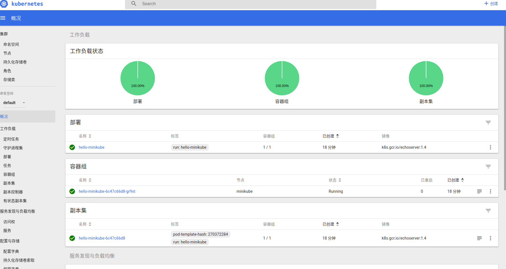

# minikube
## GFW
## all proxy
### before using socks5 proxy
make sure ss client is running
1. add this code to `.zshrc`
```
alias setproxy="export ALL_PROXY=socks5://127.0.0.1:1080"
alias unsetproxy="unset ALL_PROXY"
alias myip="curl -i http://ip.cn"
```
2. `source .zshrc`
3. `myip`
4. `setproxy` 
5. `myip` you will see your ip address ip changed to socks5 proxy ip

## docker proxy config 
TODO:　验证
1. Create a systemd drop-in directory for the docker service:
```
$ sudo mkdir -p /etc/systemd/system/docker.service.d
```
1. Create a file called `/etc/systemd/system/docker.service.d/http-proxy.conf` that adds the `HTTP_PROXY` environment variable:
```
[Service]
Environment="HTTP_PROXY=http://proxy.example.com:80/"

[Service]
Environment="HTTP_PROXY=socks5://127.0.0.1:1080/" "NO_PROXY=localhost,127.0.0.1,docker.io,yanzhe919.mirror.aliyuncs.com,99nkhzdo.mirror.aliyuncs.com,*.aliyuncs.com,*.mirror.aliyuncs.com,registry.docker-cn.com,hub.c.163.com,hub-auth.c.163.com,"

```
Or, if you are behind an HTTPS proxy server, create a file called   `/etc/systemd/system/docker.service.d/https-proxy.conf`  that adds the `HTTPS_PROXY` environment variable:
```
[Service]
Environment="HTTPS_PROXY=https://proxy.example.com:443/"

[Service]
Environment="HTTPS_PROXY=socks5://127.0.0.1:1080/" "NO_PROXY=localhost,127.0.0.1,docker.io,yanzhe919.mirror.aliyuncs.com,99nkhzdo.mirror.aliyuncs.com,*.aliyuncs.com,*.mirror.aliyuncs.com,registry.docker-cn.com,hub.c.163.com,hub-auth.c.163.com,"

```
2. If you have internal Docker registries that you need to contact without proxying you can specify them via the `NO_PROXY` environment variable:
```
[Service]    
Environment="HTTP_PROXY=http://proxy.example.com:80/" "NO_PROXY=localhost,127.0.0.1,docker-registry.somecorporation.com"
```
Or, if you are behind an HTTPS proxy server:
```
[Service]    
Environment="HTTPS_PROXY=https://proxy.example.com:443/" "NO_PROXY=localhost,127.0.0.1,docker-registry.somecorporation.com"
```
4. Flush changes:
```
$ sudo systemctl daemon-reload
```
5. Restart Docker:
```
$ sudo systemctl restart docker
```
6. Verify that the configuration has been loaded:
```
$ systemctl show --property=Environment docker
Environment=HTTP_PROXY=http://proxy.example.com:80/
```
Or, if you are behind an HTTPS proxy server:
```
$ systemctl show --property=Environment docker
Environment=HTTPS_PROXY=https://proxy.example.com:443
```
Ref: https://docs.docker.com/config/daemon/systemd/#httphttps-proxy
## install
```
curl -Lo minikube https://storage.googleapis.com/minikube/releases/latest/minikube-linux-amd64 && chmod +x minikube && sudo mv minikube /usr/local/bin/
```
## Quickstart
### Linux
```
sudo -E ./minikube start --vm-driver=none
Starting local Kubernetes v1.7.5 cluster...
Starting VM...
SSH-ing files into VM...
Setting up certs...
Starting cluster components...
Connecting to cluster...
Setting up kubeconfig...
Kubectl is now configured to use the cluster. 
```
#### 失败的几种情况  

1. 下载成功 错误为 `VBoxManage not found` 安装 `VirtualBox or KVM`  
    * linux 启动的时候　可以带上　`--vm-driver=none`
2. 一直卡死  
    * `minikube delete && rm -rf ~/.minikube`
    * `minikube start --bootstrapper=localkube`
    *  kubeadm reset      
3. certificate apiserver-kubelet-client is not signed by corresponding CA
    * 删！！！把对应的缓存　文件全部删除
    * `/tmp/` 目录 `$USER/.kube`,`$USER/.minikube`,`/var/lib/localkube/certs/`,`/var/lib/kubelet/pki`
    * 我还卸载了之前安装的 `snap remove kubectl`  

更多参考：　https://github.com/kubernetes/minikube/blob/master/README.md

### Windows 10
### install docker
### install hyper-v
### config hyper-v network
### minikube start

### dashboard
`minikube dashboard`  
